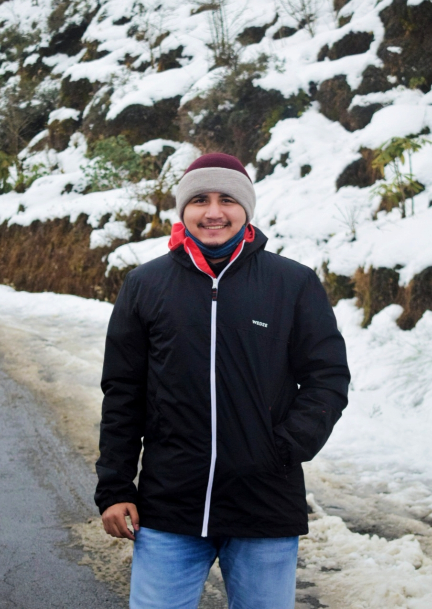

{width=25%} 

## Professional

As a child, I wanted to be a chemist like my father. From a very young age, I was aware that pharmaceutical drugs cure or prevent diseases. Hoping to understand how these magical pills work, I always used to ask my family about these chemical compounds and how they heal us. In search of deeper explanations, I started my journey into the world of biology. Soon enough, I realized the complexity of living systems, from whole organisms to cells to atoms. In this pursuit of mine, I discovered that my initial interest in understanding the working principle of pharma drugs had imbued in me a deep drive to explore the building blocks of life. After a rigorous science-focused high school education, I chose to study biotechnology which gave me a broader knowledge regarding the application of biological discoveries and inventions for the betterment of human lives.
    

## Academic Journey

Throughout the journey of being an undergraduate biotechnology student at the [KIIT University](https://kiit.ac.in/){target="_blank"} India, I became more and more interested in research. Transitioning from learning science to conducting scientific research occurred when I worked as a summer intern in 2018 at my university. I worked as part of a team that investigated the role of metals in improving the underwater adhesive property of the mucus hydrogel from the slug Laevicaulis alte. While I enjoyed work and got exposed to the world of material science, I felt something was missing from all this. 
To explore my interest in better understanding the process of protein translation from a structural perspective, I conducted my master’s thesis work in the lab of Dr. Jayati Sengupta at the [CSIR-Indian Institute of Chemical Biology (IICB)](https://www.iicb.res.in/){target="_blank"}. There I investigated the role of Elongation factor-G, a highly conserved GTPase, in mycobacterial translation. After completing my undergraduate degree, I joined as a Junior Research Fellow in the lab of Dr. Moumita Dutta at [ICMR-National Institute of Cholera and Enteric Diseases, India](https://www.niced.org.in/){target="_blank"}. In her lab, I have been using [cryo-electron tomography](https://en.wikipedia.org/wiki/Electron_cryotomography){target="_blank"} to probe the structural interactions of a newly isolated lytic Shigella phage with its host to build up an infection initiation model. 

## Contact

Want to chat?  Go ahead, pipe up!  Feel free to contact me on [email](mailto:anindadutta86@gmail.com){target="_blank"}, [Twitter](https://twitter.com/anindadutta86){target="_blank"}, or [LinkedIn](https://linkedin.com/in/anindadutta86/){target="_blank"}. I hope to hear from you!

